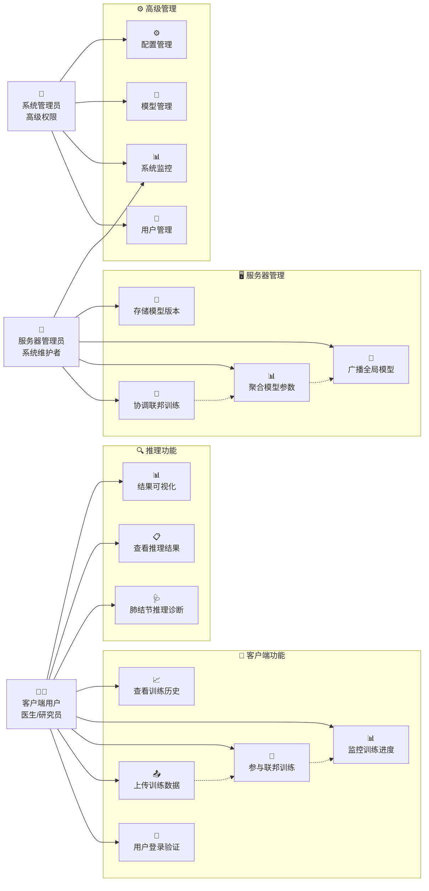
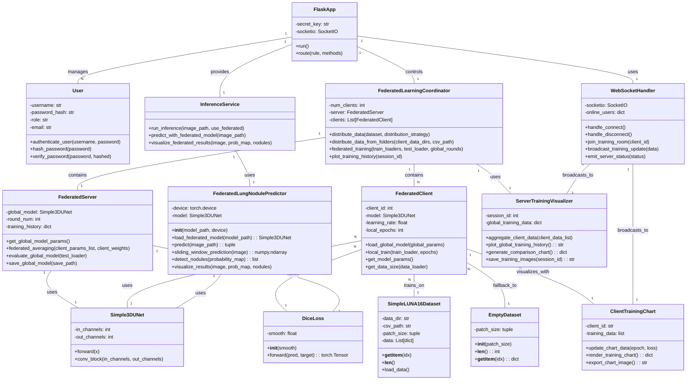
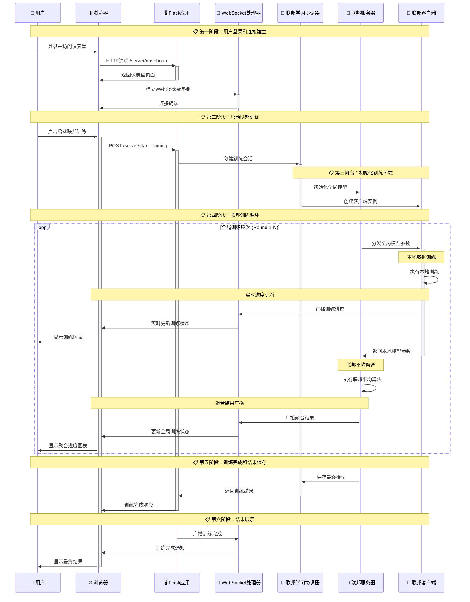
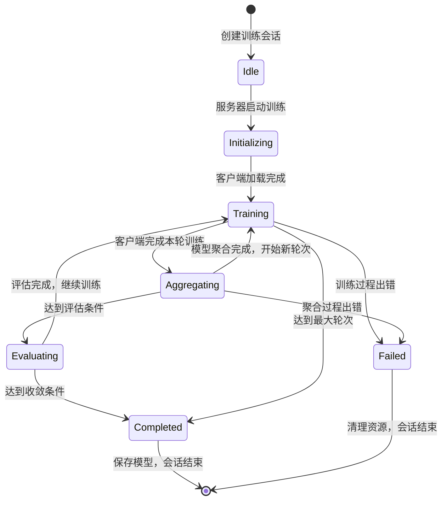
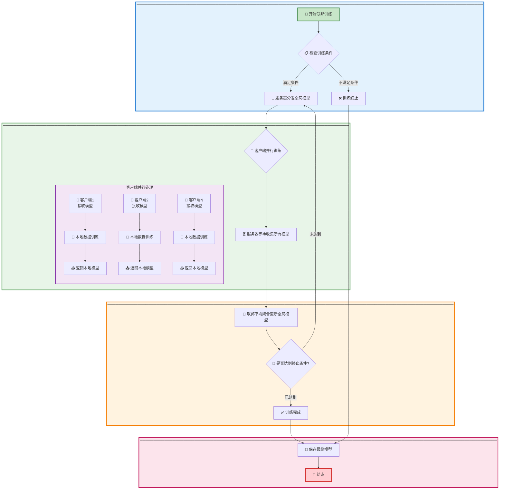
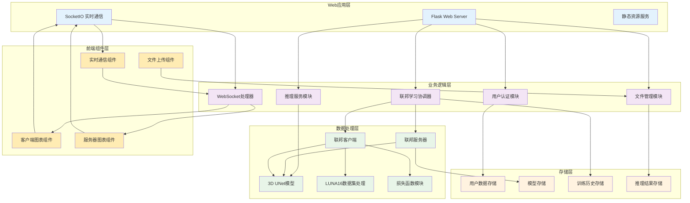
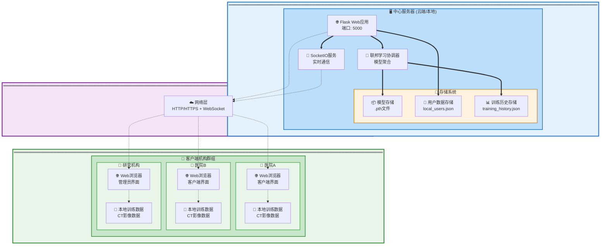

# 系统建模报告

## 1. 概述

本文档旨在通过UML（统一建模语言）图表，从不同角度对"基于联邦学习的分布式医疗影像诊断系统"进行建模，以便更清晰、更直观地理解系统的结构、功能和行为。报告包含用例图、类图、序列图、状态图、活动图、组件图和部署图。

## 2. 用例图 (Use Case Diagram)

用例图展示了系统的主要功能和用户交互。采用水平布局，优化字体显示效果。

### 用例说明：
- **客户端用户**: 代表使用系统的各个参与方（如医院、研究机构），可以上传训练数据、查看训练历史、执行推理任务。
- **服务器管理员**: 系统的核心管理者，负责启动和监控联邦学习过程、管理全局模型、执行服务器端推理。
- **系统管理员**: 具有最高权限的管理者，负责用户管理、系统监控、模型管理和配置管理。

## 3. 类图 (Class Diagram)

类图展示了系统的静态结构，包括主要的类、它们的属性、方法以及它们之间的关系。

- **FlaskApp**: 基于Flask的Web应用，集成了SocketIO进行实时通信，是系统的核心入口。
- **User**: 用户实体，支持基于角色的访问控制，包括客户端用户和服务器管理员。
- **FederatedServer**: 联邦学习服务器，负责全局模型管理、模型聚合和训练协调。
- **FederatedClient**: 联邦学习客户端，负责本地模型训练和参数上传。
- **FederatedLearningCoordinator**: 联邦学习协调器，管理整个联邦学习过程，包括数据分发和训练流程。
- **Simple3DUNet**: 3D UNet神经网络模型，用于肺结节检测的深度学习模型。
- **SimpleLUNA16Dataset**: LUNA16数据集的处理类，负责数据加载和预处理。
- **InferenceService**: 推理服务，提供模型推理和结果可视化功能。
- **DiceLoss**: Dice损失函数，专门用于医学图像分割任务的损失计算。
- **FederatedLungNodulePredictor**: 联邦学习肺结节预测器，负责加载联邦模型并进行推理预测。
- **EmptyDataset**: 空数据集，在联邦学习中处理没有数据的客户端情况。
- **ClientTrainingChart**: 客户端训练图表生成器，负责客户端训练过程的可视化。
- **ServerTrainingVisualizer**: 服务器训练可视化器，负责全局训练过程的图表生成和数据聚合。
- **WebSocketHandler**: WebSocket事件处理器，负责实时通信、用户连接管理和训练数据广播。

## 4. 序列图 (Sequence Diagram)

序列图展示了对象之间交互的时间顺序。下面是“联邦学习一轮训练”的核心交互过程。

该图展示了从用户请求参与训练开始，到服务器分发模型、客户端本地训练、服务器聚合模型，最后将状态返回给用户的完整流程。

## 5. 状态图 (State Diagram)

状态图描述了一个对象在其生命周期内的各种状态以及状态之间的转换。下面是 `TrainingSession`（训练会话）对象的状态图。

- **Idle (空闲)**: 训练会话已创建但尚未开始，等待服务器启动。
- **Initializing (初始化)**: 服务器正在初始化全局模型和客户端，准备开始训练。
- **Training (训练中)**: 客户端正在进行本地训练，服务器等待客户端返回模型参数。
- **Aggregating (聚合中)**: 服务器正在收集并聚合来自客户端的本地模型参数，更新全局模型。
- **Evaluating (评估中)**: 服务器正在评估当前全局模型的性能。
- **Completed (已完成)**: 训练过程正常完成，达到收敛条件或最大轮次。
- **Failed (失败)**: 训练过程中出现错误，需要终止会话。

## 6. 活动图 (Activity Diagram)

活动图描述了系统特定业务流程中的工作流或活动顺序。下图展示了“联邦学习单轮训练”的详细活动流程。

此图清晰地展示了从训练开始到结束，服务器和客户端之间的交互、并行处理以及决策逻辑。

## 7. 组件图 (Component Diagram)

组件图展示了系统的模块化结构和组件之间的依赖关系。

- **Web应用层**: 提供HTTP服务和WebSocket实时通信，处理用户请求和静态资源服务。
- **业务逻辑层**: 包含核心业务逻辑，如用户认证、联邦学习协调、推理服务、文件管理和WebSocket处理。
- **数据处理层**: 负责具体的数据处理任务，包括联邦学习算法、深度学习模型、数据集处理和损失函数计算。
- **前端组件层**: 包含前端JavaScript组件，负责实时图表展示、用户交互和文件上传等功能。
- **存储层**: 管理各类数据的持久化存储，包括用户数据、模型文件、训练历史和推理结果。

## 8. 部署图 (Deployment Diagram)

部署图描述了系统硬件和软件的物理部署结构。为了提高可读性，采用垂直分层布局。

该图显示了基于Web的联邦学习系统的实际部署架构，中心服务器集成了Flask Web应用、SocketIO实时通信和联邦学习协调器，多个客户端机构通过Web浏览器连接到中心服务器，实现基于HTTP/HTTPS和WebSocket的分布式训练。

---

