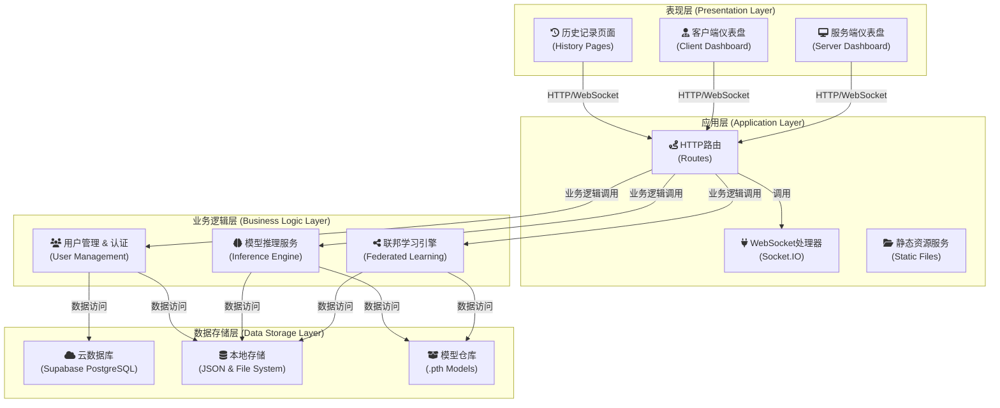
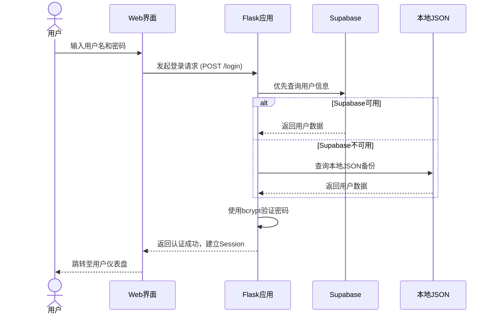
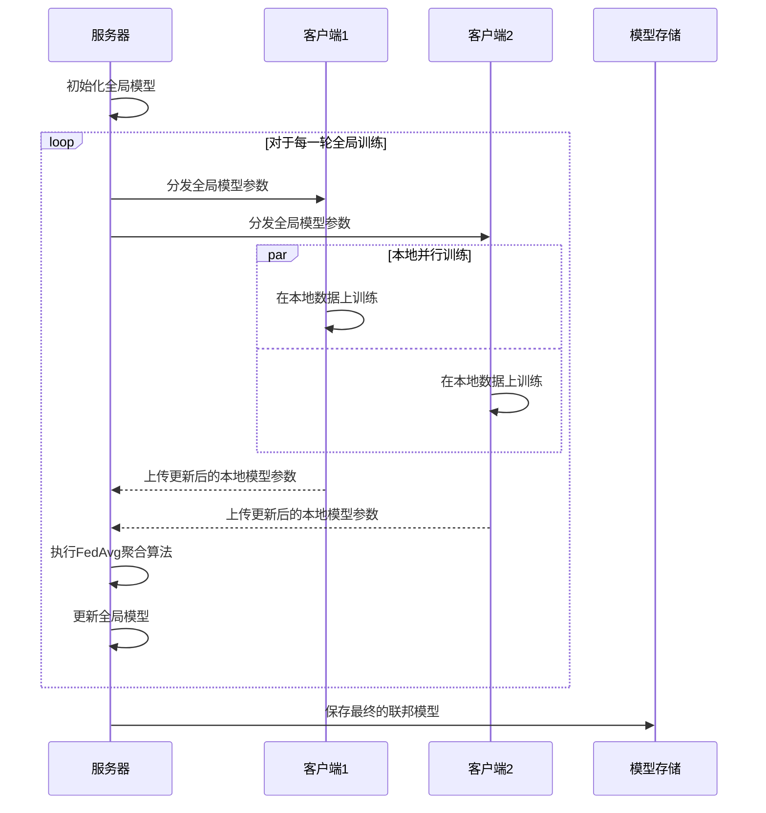
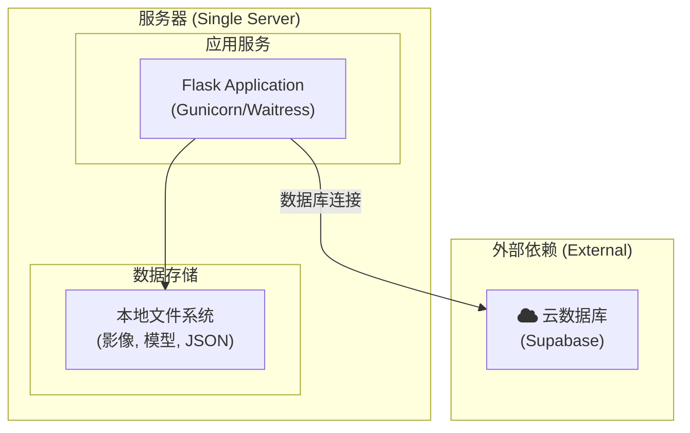
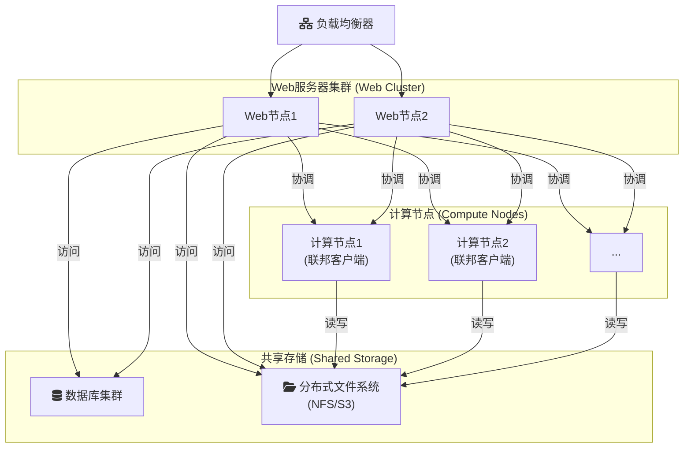

# 基于联邦学习的分布式医疗影像诊断系统 - 架构设计文档

---

## 1. 系统概述

### 1.1 设计目标

本系统旨在构建一个基于**联邦学习（Federated Learning, FL）**的分布式肺结节智能检测平台。其核心设计目标是在严格保护各参与方（如医院、研究机构）数据隐私的前提下，通过协同训练的方式，构建一个高精度、高泛化能力的AI模型。

系统采用现代化的Web架构，为用户提供从数据管理、模型训练、实时监控到智能推理的全流程可视化服务。

### 1.2 核心特性

-   **数据隐私安全**：严格遵循联邦学习原则，原始医疗数据不出本地，仅在参与方之间交换加密后的模型参数。
-   **分布式协同训练**：基于经典的`FedAvg`算法，实现多节点、分布式的模型协同训练与聚合。
-   **实时化交互监控**：采用`WebSocket`技术，实现服务端与客户端之间的状态实时同步和训练进程的可视化展示。
-   **智能化模型服务**：集成基于`3D UNet`的深度学习模型，提供在线的肺结节智能检测与可视化推理服务。
-   **用户友好的界面**：提供简洁直观的Web仪表盘，支持图表化展示，降低用户操作门槛。

---

## 2. 系统架构设计

### 2.1 总体分层架构

本系统采用经典的分层架构模式，将系统解耦为表现层、应用层、业务逻辑层和数据存储层，确保了系统的高内聚、低耦合，易于维护和扩展。



### 2.2 技术选型 (Technology Stack)

#### 2.2.1 前端技术

-   **UI 框架**: `HTML5` / `CSS3` / `JavaScript (ES6+)` - 构建现代化的响应式用户界面。
-   **实时通信**: `Socket.IO Client` - 实现与后端的低延迟、双向实时通信。
-   **数据可视化**: `Chart.js` - 用于将训练过程中的损失、准确率等数据以图表形式动态展示。
-   **图标库**: `Font Awesome` - 提供丰富的矢量图标，提升界面的美观度和可读性。

#### 2.2.2 后端技术

-   **Web 框架**: `Flask 3.0.3` - 轻量级、灵活的Python Web框架，作为应用的基础骨架。
-   **实时通信**: `Flask-SocketIO 5.5.1` - 为Flask应用提供WebSocket支持，是实时通信的核心。
-   **深度学习**: `PyTorch 2.6.0` - 用于深度学习模型的定义、训练、验证和推理。
-   **医学影像处理**: `SimpleITK 2.5.0` - 专业的医学影像读取、处理和分析库。
-   **数据处理**: `NumPy` / `Pandas` - Python科学计算与数据分析的核心库。
-   **安全**: `bcrypt` - 用于密码的哈希加密与安全验证，保障用户账户安全。

#### 2.2.3 数据存储

-   **云数据库**: `Supabase (PostgreSQL)` - 作为主要的用户信息、训练历史等结构化数据的云端存储方案。
-   **本地JSON文件**: 作为用户数据的本地备份，增强系统的鲁棒性和容灾能力。
-   **文件系统**: 用于存储医疗影像数据（`.mhd/.raw`）、模型文件（`.pth`）等大型非结构化数据。

---

## 3. 核心模块设计

### 3.1 Web应用层 (`app.py`)

作为系统的总控制中心，负责协调前后端交互和业务逻辑调用。

#### 3.1.1 架构职责

-   **HTTP路由管理**：处理所有HTTP请求，分发至不同视图函数，并渲染Web页面。
-   **WebSocket通信**：管理WebSocket连接，处理实时事件的接收和广播。
-   **会话与认证**：基于`Flask Session`实现用户认证、会话保持和权限控制。
-   **文件管理**：处理客户端上传的医疗影像数据，进行校验和存储。

#### 3.1.2 关键组件示例

```python
# 核心Flask应用与SocketIO实例
app = Flask(__name__)
socketio = SocketIO(app, cors_allowed_origins="*")

# 全局状态管理器，用于跟踪系统核心状态
training_status = {
    "is_training": False,
    "current_round": 0,
    # ... 其他状态
}

# 在线用户跟踪器
online_users = {}  # 格式: {session_id: user_info}
user_sessions = {} # 格式: {username: {session_id_1, session_id_2}}
```

### 3.2 联邦学习引擎 (`federated_training.py`)

实现了联邦学习的核心算法和训练流程控制。

#### 3.2.1 核心类设计

-   `FederatedServer`: 联邦学习服务器，负责全局模型的维护和聚合。
-   `FederatedClient`: 联邦学习客户端，负责在本地执行模型训练。
-   `FedAvgCoordinator`: 联邦学习协调器，负责编排整个`FedAvg`训练流程。

#### 3.2.2 FedAvg算法流程

1.  **初始化 (Initialization)**：服务器创建初始的全局模型。
2.  **分发 (Distribution)**：服务器将当前全局模型的参数分发给所有选定的客户端。
3.  **本地训练 (Local Training)**：每个客户端使用自己的本地数据对模型进行多轮训练。
4.  **聚合 (Aggregation)**：服务器收集所有客户端更新后的模型参数，并使用加权平均算法（FedAvg）进行聚合，生成新的全局模型。
5.  **更新与迭代 (Update & Iteration)**：服务器使用聚合后的参数更新全局模型，并重复步骤2-4，直至达到预设的训练轮数。

### 3.3 深度学习模型 (`train_simple_model.py`)

定义了用于肺结节检测的`3D UNet`网络结构和数据加载器。

#### 3.3.1 3D UNet架构

```python
class Simple3DUNet(nn.Module):
    """
    一个为肺结节检测任务优化的简化版3D UNet模型。
    
    网络结构:
    - Encoder: 3层下采样模块，每层包含卷积和最大池化，用于提取层次化特征。
    - Bottleneck: 网络的瓶颈层，用于深度特征提取。
    - Decoder: 3层上采样模块，每层包含反卷积和特征融合（Skip Connection），用于恢复空间分辨率。
    - Output Layer: 输出层，生成像素级的分割结果。
    """
```

### 3.4 推理引擎 (`federated_inference_utils.py`)

封装了从模型加载到结果可视化的完整推理流程。

#### 3.4.1 推理流程

```python
class FederatedLungNodulePredictor:
    """
    联邦学习肺结节预测器，提供端到端的推理服务。
    
    执行流程:
    1. 加载训练好的联邦模型（.pth文件）。
    2. 对输入的CT影像进行预处理（重采样、归一化等）。
    3. 采用滑窗（Sliding Window）策略对整个三维影像进行推理。
    4. 对推理结果进行后处理（如非极大值抑制）和可视化。
    """
```

---

## 4. 数据流设计

### 4.1 用户认证流程



### 4.2 联邦学习训练流程



---

## 5. 关键设计决策

### 5.1 架构模式选择

-   **决策**: **单体架构 (Monolithic Architecture)**
-   **理由**:
    > 考虑到当前项目规模适中，核心功能内聚，单体架构能够显著简化开发、调试和部署的复杂度。它避免了微服务架构中额外的网络开销和分布式系统管理成本，更适合快速迭代和原型验证。

### 5.2 技术选型决策

-   **决策**: **Flask + WebSocket (Socket.IO)**
-   **理由**:
    > Flask以其轻量级和高可扩展性著称，非常适合构建中小规模的Web应用。结合Flask-SocketIO插件，可以无缝地实现WebSocket实时通信，满足系统对状态同步和实时监控的核心需求，且社区成熟，解决方案完善。

-   **决策**: **PyTorch**
-   **理由**:
    > PyTorch凭借其动态计算图、丰富的API和活跃的社区，已成为科研和工业界深度学习应用的首选框架之一。其灵活性和易用性非常适合复杂的医学影像处理和模型实验。

### 5.3 数据存储策略

-   **决策**: **云端 + 本地双重存储**
-   **理由**:
    > 将用户信息等关键结构化数据存储在`Supabase`云数据库中，以获得高可用性和可访问性。同时，在本地保留JSON文件作为备份，并存储大型影像文件。这种策略既利用了云服务的优势，又通过备份机制避免了单点故障，同时满足了数据本地化的隐私要求。

---

## 6. 部署架构

### 6.1 单机部署模式

适用于开发、测试或小规模应用场景。



### 6.2 分布式部署模式（概念）

适用于生产环境，可实现高可用和负载均衡。



---

## 7. 总结

### 7.1 架构优势

1.  **隐私保护优先**: 架构设计严格遵循联邦学习原则，从根本上保障了数据隐私安全。
2.  **技术栈现代化**: 选用了Flask, PyTorch, WebSocket等成熟且前沿的技术，保证了系统的性能和可维护性。
3.  **高度可扩展性**: 模块化的设计和分层架构为未来的功能扩展（如新算法、新模型）和性能提升（如分布式部署）奠定了坚实基础。
4.  **用户体验良好**: 通过实时通信和可视化界面，提供了直观、高效的用户交互体验。

### 7.2 未来展望

-   **增强安全性**: 集成差分隐私（Differential Privacy）、同态加密（Homomorphic Encryption）等技术，进一步提升模型参数交换的安全性。
-   **优化联邦算法**: 探索并集成更多先进的联邦学习算法，如`FedProx`, `SCAFFOLD`等，以应对数据异构性等挑战。
-   **提升系统性能**: 对训练和推理流程进行深度优化，并探索在更复杂的分布式环境下的部署方案。

本架构为构建一个安全、高效、可扩展的分布式医疗AI平台提供了清晰的蓝图和坚实的技术基础。
